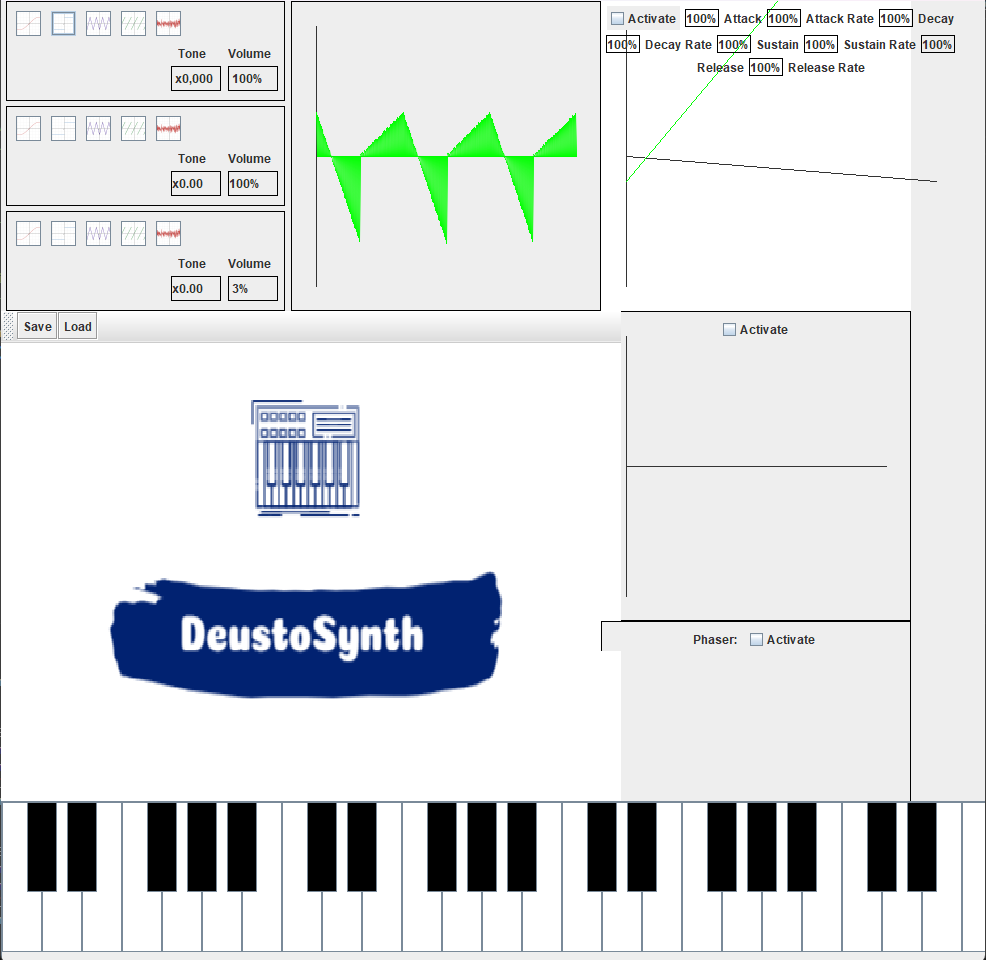

# Frequency Modulator Synthesizer

### Project Preview

## Features 
⚡️ Multiple oscillator soundwave generation
⚡️ Wave plotting
⚡️ Various waveforms
⚡️ Custom audiofile sampler
⚡️ ADSR Filter
⚡️ Phaser filter
⚡️ MIDI Controller friendly
⚡️ Multiple oscillator soundwave generation
⚡️ Save and load custom made presets

## Installation & Deployment 📦
- Clone the repository
- Build with Java 14 or newer, and JDK 20 or newer

## License

- **[MIT license](http://opensource.org/licenses/mit-license.php)**

NOTE: All images used in this project are copyright-free and available for non-commercial use
